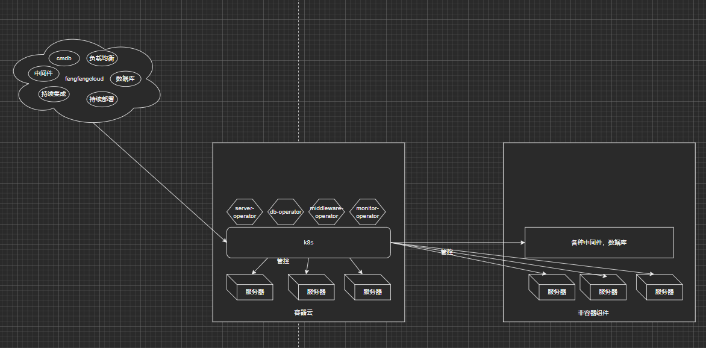

# 云平台设计

此项目主要记录云平台整体的规划。包括设计，todo list。等等


## smartfengcloud规划

```
此云平台主要分为三个部分，包括容器云，云管理平台，以及其他非容器组件。

容器云为此云平台的核心。是所有数据，控制的核心，依赖k8s实现。所有对云平台的操作，包括任何资源的CURD，服务的部署，下线，认证，鉴权，用户体系全基于k8s实现。哪怕是非k8s上的资源，比如服务器上各种中间件，数据库的部署，上下线，更新，都会通过k8s的逻辑进行控制。物理服务器也是k8s中的一种资源，非容器组件，都是基于物理物理服务器资源构建。

云管理平台所有的功能都依赖k8s的接口，k8s本身就是云平台的配置中心，数据中心。所有能在云管理平台的操作，都可以通过kubectl命令实现。

非容器组件，每一个组件都会在k8s中对应一种资源，通过对k8s中资源的操作，完成对组件的部署，扩缩容等。
```

## todo list

- [ ] server crd  
- [ ] mysql-server-operator  
- [ ] ci/cd 

## Contributing

PRs accepted.

## License

MIT © Richard McRichface
